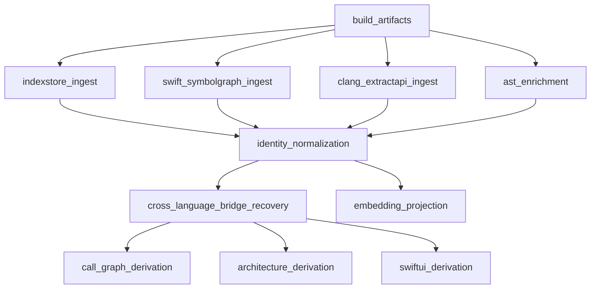

# Orchard 架构设计

> Orchard: Compiler-Grade Apple Semantic Graph for Agents

## 目标

构建一个支持：

- Swift
- Objective‑C
- Objective‑C++
- C
- C++

的 Apple 平台代码知识图谱（Code Intelligence System）。

提供给 AI Agent：

- 调用链分析
- 架构分析
- dependency graph
- impact analysis
- semantic search
- cross-language relation
- protocol/type graph
- SwiftUI graph
- RAG / embedding context

而不是传统 IDE 功能。

这里需要区分三层：

- 编译器或工具链直接产出的事实层
- 统一图谱后的语义层
- 在图谱之上派生出来的高级能力层

其中：

- `IndexStore`
- Symbol Graph
- AST / syntax / comments

属于事实层输入。

而：

- impact analysis
- architecture graph
- SwiftUI graph

属于图谱之上的派生能力，不应误写成某个底层组件“原生直接提供”。

---

# 一、核心理念

## 不以 LSP 为中心

本系统不是：

```text
IDE assistant
```

而是：

```text
Compiler-grade semantic graph system
```

核心数据来源：

```text
build system
↓
compiler semantic artifacts
↓
IndexStore / Symbol Graph / AST
```

不是：
- tree-sitter
- grep
- LSP hover

---

# 二、整体架构

```text
                    ┌─────────────────────┐
                    │ Claude / Agent      │
                    └──────────┬──────────┘
                               │ MCP
                    ┌──────────▼──────────┐
                    │ Orchard MCP         │
                    │ Server              │
                    └──────────┬──────────┘
                               │
      ┌────────────────────────┼────────────────────────┐
      │                        │                        │
      ▼                        ▼                        ▼

┌──────────────┐      ┌──────────────┐       ┌──────────────┐
│ Query Layer  │      │ Graph Layer  │       │ Context Layer│
└──────┬───────┘      └──────┬───────┘       └──────┬───────┘
       │                     │                      │
       ▼                     ▼                      ▼

┌──────────────┐      ┌──────────────┐       ┌──────────────┐
│ IndexStoreDB │      │ Swift Symbol │       │ SourceKitten │
│              │      │ Graph /      │       │ / libclang   │
│              │      │ Clang        │       │              │
│              │      │ ExtractAPI   │       │              │
└──────┬───────┘      └──────┬───────┘       └──────┬───────┘
       │                     │                      │
       └─────────────────────┼──────────────────────┘
                             ▼

                    ┌──────────────────┐
                    │ Unified Graph DB │
                    │ Ladybug          │
                    └────────┬─────────┘
                             │
                             ▼

                    ┌──────────────────┐
                    │ Embedding Layer  │
                    └──────────────────┘

                             ▲
                             │

                    ┌────────┴─────────┐
                    │ xcodebuild       │
                    │ swift build      │
                    │ other compiler-  │
                    │ driven build     │
                    └────────┬─────────┘
                             │
                             ▼

                    ┌──────────────────┐
                    │ IndexStore /     │
                    │ Symbol Graph /   │
                    │ API extraction   │
                    └──────────────────┘
```

---

# 三、核心组件职责

---

## 1. build system（核心入口）

`xcodebuild` 是 Apple 平台最常见的构建入口，但不是唯一入口。

真正的 authoritative source 是：

- 编译器在真实构建过程中产出的语义工件
- 包括 `IndexStore`、Symbol Graph、API extraction 结果，以及按需解析出的 AST 信息

负责：

- module resolution
- macro expansion
- bridging header
- Swift ↔ ObjC bridge
- template instantiation
- generate IndexStore
- drive API extraction / symbol graph emission

常见入口：

```bash
xcodebuild build
```

也可以是：

```bash
swift build
```

或者其他真正调用 Swift / Clang 编译器的构建系统。

推荐把 build 侧最少采集为：

```ts
interface BuildContext {
  build_id: string
  build_system: "xcodebuild" | "swift_build" | "other"
  workspace_root: string
  scheme?: string
  target: string
  configuration: string
  sdk: string
  triple: string
  toolchain_id: string
  derived_data_path?: string
  index_store_path?: string
  symbolgraph_output_path?: string
  commit_sha?: string
  build_config_hash: string
}
```

这不是附属元数据，
而是后续：

- freshness 判断
- target 去歧义
- bridge 恢复
- 结果可复现性

的基础输入。

---

## 2. IndexStoreDB（核心中的核心）

它是统一图谱的基础索引层，不是完整知识图谱本身。

直接提供的原始能力：

- references
- symbol occurrences
- symbol relations
- fast lookup by symbol / occurrence / relation

适用于：

- Swift
- ObjC
- C
- C++

在它之上可以派生：

- callers / callees
- dependency graph
- impact analysis
- architecture graph
- 部分 cross-language relation

---

## 3. swift-symbolgraph-extract

仅用于 Swift。

适合补充的语义层：

- type graph
- protocol hierarchy
- inheritance
- generic constraints
- public API graph

输出：

```json
{
  "symbols": [],
  "relationships": []
}
```

适合：

- AI semantic graph
- architecture reasoning
- type understanding

它更像：

```text
Swift API / type relationship layer
```

不是整个 Apple 图谱的唯一 symbol graph 来源。

---

## 4. Clang ExtractAPI / Symbol Graph

用于 C / Objective‑C / C++ 的 API 与关系抽取。

适合补充：

- C / ObjC / C++ public API graph
- declaration relationships
- symbol graph serialization
- 与 Swift Symbol Graph 对齐的 API 表达层

适合：

- C-family API graph
- ObjC hierarchy
- public surface reasoning

---

## 5. SourceKitten

Swift AST 工具。

负责：

- declaration structure
- syntax tree
- comments
- code chunking

适合：

- embedding
- prompt context
- chunk extraction

如果要做 SwiftUI graph，SourceKitten 更适合充当：

```text
SwiftUI 静态分析输入层
```

而不是单独承担完整的 `view tree / navigation flow` 推导。

---

## 6. libclang

ObjC/C/C++ AST 来源。

负责：

- ObjC hierarchy
- C++ inheritance
- include graph
- preprocessing / macro record

适合：

- on-demand AST drill-down
- include / inheritance / receiver-level context
- 辅助补齐 IndexStore 和 ExtractAPI 没直接给出的细节

---

# 四、为什么不以 LSP 为核心

LSP 是：

```text
interactive editor protocol
```

不是：

```text
global code intelligence backend
```

LSP 适合：

- hover
- completion
- rename
- diagnostics

但 AI 更需要：

- code graph
- architecture graph
- dependency graph
- impact analysis
- semantic retrieval

因此，对这个系统更准确的说法是：

```text
IndexStoreDB / compiler artifacts are more fundamental than LSP
```

LSP 可以作为查询入口或编辑器接面，
但不应该被当成唯一语义真源。

---

# 五、统一 Symbol 模型

```ts
interface SymbolNode {
  usr: string
  precise_id?: string

  language:
    | "swift"
    | "objc"
    | "cpp"
    | "c"

  kind:
    | "class"
    | "protocol"
    | "function"
    | "method"
    | "struct"
    | "enum"
    | "extension"
    | "property"
    | "typealias"

  name: string

  module: string

  file_path: string

  target?: string

  container_usr?: string

  signature?: string

  access_level?: "private" | "fileprivate" | "internal" | "public" | "open"

  origin?:
    | "indexstore"
    | "swift_symbolgraph"
    | "clang_extractapi"
    | "sourcekitten"
    | "libclang"
    | "derived"

  is_generated?: boolean

  availability?: string[]
}
```

这里有几个字段不应省略：

- `usr` / `precise_id`
- `module`
- `file_path`
- `origin`

因为 Apple 侧很多“看起来同名”的实体，
只有结合：

- 稳定标识
- 所属 module / target
- 来源工件

才能真正做对去重、桥接和 impact analysis。

---

# 六、统一 Edge 模型

```ts
interface Edge {
  type:
    | "calls"
    | "references"
    | "inherits"
    | "implements"
    | "imports"
    | "contains"
    | "bridges_to"

  from: string
  to: string

  source?:
    | "indexstore"
    | "swift_symbolgraph"
    | "clang_extractapi"
    | "sourcekitten"
    | "libclang"
    | "derived"

  confidence?: number

  provenance?: string

  build_id?: string
}
```

推荐把 edge 当成“带证据的关系”，
而不是只是：

```text
from -> to
```

尤其在下面这些边上必须保留 provenance：

- `calls`
- `references`
- `implements`
- `imports`
- `bridges_to`

因为它们有的来自：

- 编译器 occurrence/relation
- symbol graph relationship
- AST 推断
- 构建配置恢复
- 上层派生

不把这些差异显式保存，
后面的 agent 很难判断一条边到底有多可信。

---

# 七、USR（最关键）

Apple tooling 的核心概念：

```text
USR
Unified Symbol Resolution
```

很多核心 declaration-level symbols 都可以围绕稳定标识统一：

- Swift
- ObjC
- C++
- C

因此图谱层应优先围绕：

- USR
- precise identifier
- 归一化后的 module / file / symbol identity

建立，而不是只围绕文本名称建立。

---

# 八、跨语言支持

目标支持：

```text
Swift ↔ ObjC
ObjC ↔ C++
Swift ↔ C
```

但需要加边界：

- Swift 默认支持与 C / Objective‑C 互操作
- Swift 与 C++ / Objective‑C++ 互操作通常需要显式开启
- 跨语言 relation 的恢复能力依赖真实 build 配置、module 边界和可见性

原因是：

编译器与构建产物能提供：

- bridging header
- generated swift interface
- ObjC selector bridge
- module import

而上层图谱需要把这些线索进一步归一化成可查询边。

---

# 九、推荐数据库方案

## Phase 1（推荐：本地嵌入式图后端）

```text
Ladybug
```

适合：

- 本地单项目 / 单工作区 semantic graph
- MCP 友好
- graph traversal + semantic search 一体化
- Apple 工具链侧嵌入

原因：

- Property Graph + Cypher
- 原生 FTS
- 原生 vector index
- 单文件持久化
- ACID transaction
- Swift client 可直接接入 Apple 侧工具链

边界：

- 它属于 `Unified Graph DB`，不是 `IndexStoreDB / Symbol Graph / AST` 的替代品
- 更适合作为本地嵌入式后端，不应默认假设为团队级中心化服务
- FTS / vector 更适合建立在 `Chunk / Symbol / File` 这类节点属性上
- 事务模型更接近 `many readers + single writer`

---

## Phase 3（仅在复杂图分析明确成为瓶颈时评估）

```text
Neo4j
```

仅当需要：

- 深层 graph traversal
- architecture analytics
- cyclic dependency analysis

它不再是默认首选。

---

# 十、推荐图 Schema（以 Ladybug 为例）

## Graph

```cypher
CREATE GRAPH code_graph;
USE code_graph;
```

---

## Node Tables

```cypher
CREATE NODE TABLE Module(
  name STRING PRIMARY KEY,
  language STRING
);

CREATE NODE TABLE Target(
  id STRING PRIMARY KEY,
  name STRING,
  platform STRING,
  sdk STRING,
  triple STRING,
  configuration STRING
);

CREATE NODE TABLE BuildSnapshot(
  id STRING PRIMARY KEY,
  build_system STRING,
  workspace_root STRING,
  derived_data_path STRING,
  index_store_path STRING,
  toolchain_id STRING,
  commit_sha STRING,
  created_at STRING,
  build_config_hash STRING
);

CREATE NODE TABLE File(
  path STRING PRIMARY KEY,
  module STRING,
  language STRING,
  target_id STRING
);

CREATE NODE TABLE Symbol(
  usr STRING PRIMARY KEY,
  precise_id STRING,
  name STRING,
  language STRING,
  kind STRING,
  module STRING,
  target_id STRING,
  file_path STRING,
  signature STRING,
  container_usr STRING,
  access_level STRING,
  origin STRING,
  is_generated BOOL
);

CREATE NODE TABLE Chunk(
  id STRING PRIMARY KEY,
  owner_usr STRING,
  chunk_kind STRING,
  content STRING,
  embedding FLOAT[1536]
);

CREATE NODE TABLE Occurrence(
  id STRING PRIMARY KEY,
  usr STRING,
  file_path STRING,
  line INT64,
  column INT64,
  role STRING
);
```

---

## Relation Tables

```cypher
CREATE REL TABLE ContainsFile(FROM Module TO File);
CREATE REL TABLE ContainsTarget(FROM Module TO Target);
CREATE REL TABLE BuiltTarget(FROM BuildSnapshot TO Target);
CREATE REL TABLE ObservedFile(FROM BuildSnapshot TO File);
CREATE REL TABLE Declares(FROM File TO Symbol);
CREATE REL TABLE ContainsChunk(FROM Symbol TO Chunk);
CREATE REL TABLE ContainsOccurrence(FROM File TO Occurrence);
CREATE REL TABLE RefersTo(FROM Occurrence TO Symbol, role STRING);

CREATE REL TABLE Calls(
  FROM Symbol TO Symbol,
  source STRING,
  confidence DOUBLE
);

CREATE REL TABLE References(
  FROM Symbol TO Symbol,
  source STRING,
  confidence DOUBLE
);

CREATE REL TABLE Inherits(FROM Symbol TO Symbol);
CREATE REL TABLE Implements(FROM Symbol TO Symbol);
CREATE REL TABLE Imports(FROM File TO File, kind STRING);

CREATE REL TABLE BridgesTo(
  FROM Symbol TO Symbol,
  bridge_kind STRING,
  provenance STRING,
  confidence DOUBLE
);
```

---

## 为什么要加 BuildSnapshot / Target

如果不把 `BuildSnapshot` 和 `Target` 显式建模，
Apple 语义图很容易在这些场景下出错：

- 同一个 symbol 在不同 target / SDK / configuration 下可见性不同
- Swift / ObjC bridge 只在某个 build 配置下成立
- 某次查询命中了过期 index store
- 生成出来的 symbol graph 来自和当前构建不一致的 toolchain

所以更推荐的设计不是：

```text
repo -> files -> symbols
```

而是：

```text
build snapshot -> targets -> files -> symbols -> derived edges
```

这样 freshness、可见性和 provenance 才有位置可落。

---

# 十一、Embedding 设计

推荐：

按：

- type
- method
- extension
- SwiftUI View

切块。

推荐把 embedding 放在：

```text
Chunk node property
```

也就是：

```text
Chunk.content -> FTS / vector retrieval
Chunk.owner_usr -> Symbol.usr
```

其中 `FLOAT[1536]` 只是示意，实际维度应与所选 embedding model 保持一致。

而不是默认拆成独立 embedding 表。

原因是：

- semantic retrieval 的主入口通常是 `Chunk`
- `Chunk` 命中后可以回跳到 `Symbol / File / Module`
- 图边仍然保留在 `Calls / References / Inherits / BridgesTo`

如果采用 Ladybug，需要优先把：

- `Chunk.content`
- `Symbol.name`
- `File.path`

这类可检索文本保留在节点属性上。

这样：

semantic search 可以和 graph traversal 结合。

---

# 十二、推荐 MCP Tools

---

## Code Graph

```text
find_callers
find_callees
find_dependency_chain
impact_analysis
```

每个工具都建议统一返回：

```ts
interface ToolResponse<T> {
  data: T
  freshness: "fresh" | "stale" | "partially_stale" | "build_mismatch"
  build_id?: string
  evidence_sources: string[]
  confidence?: number
}
```

推荐所有工具共享一个最小基类：

```ts
interface BaseToolRequest {
  repo_root?: string
  build_id?: string
  target?: string
  module?: string
  include_derived?: boolean
  max_depth?: number
}
```

```ts
interface BaseToolResponse<T> {
  data: T
  freshness: "fresh" | "stale" | "partially_stale" | "build_mismatch" | "toolchain_mismatch"
  build_id?: string
  target?: string
  module?: string
  evidence_sources: string[]
  confidence?: number
  open_gaps: string[]
}
```

---

## Architecture

```text
get_module_graph
find_layer_violations
find_cycles
```

---

## Type System

```text
get_protocol_implementations
get_type_hierarchy
```

---

## Semantic

```text
semantic_search
find_related_symbols
```

---

## SwiftUI

```text
get_view_tree
find_navigation_flow
```

需要特别强调：

- `get_view_tree`
- `find_navigation_flow`

这类工具不应默认宣称“compiler-direct truth”，
而应在返回里带：

- `confidence`
- `evidence_sources`
- `derived_from`

因为它们本质上属于派生层。

---

## 推荐统一返回契约

无论是哪类 MCP tool，
都建议最少返回以下字段：

```json
{
  "data": {},
  "freshness": "fresh",
  "build_id": "build-20260623-001",
  "toolchain_id": "xcode-26.0-swift-6.2",
  "evidence_sources": [
    "indexstore",
    "swift_symbolgraph"
  ],
  "open_gaps": []
}
```

这样 agent 在消费结果时，
可以明确知道：

- 结果来自哪一批 build snapshot
- 是否存在 freshness 风险
- 依赖了哪些事实层输入
- 哪些结论仍有缺口

---

## 推荐 MCP Contract 细化

下面这些工具建议优先做成稳定契约，
因为它们最直接决定 agent 的可用性。

### 1. `semantic_search`

```ts
interface SemanticSearchRequest extends BaseToolRequest {
  query: string
  limit?: number
  language?: "swift" | "objc" | "cpp" | "c"
  symbol_kinds?: string[]
}

interface SemanticSearchHit {
  chunk_id: string
  owner_usr?: string
  owner_name?: string
  file_path: string
  module: string
  score: number
  excerpt: string
}
```

```ts
type SemanticSearchResponse = BaseToolResponse<{
  hits: SemanticSearchHit[]
}>
```

用途：

- 找 capability 入口
- 找相关 symbol 候选
- 给后续 `get_symbol_context` 提供种子

### 2. `get_symbol_context`

```ts
interface GetSymbolContextRequest extends BaseToolRequest {
  usr?: string
  precise_id?: string
  symbol_name?: string
  file_path?: string
}

interface SymbolContext {
  symbol: SymbolNode
  declarations: string[]
  references: string[]
  callers: string[]
  callees: string[]
  inherits: string[]
  implements: string[]
  bridges_to: string[]
}
```

```ts
type GetSymbolContextResponse = BaseToolResponse<{
  context: SymbolContext
}>
```

用途：

- 解释某个 symbol 在图里的完整位置
- 作为 impact analysis 前置查询

### 3. `find_callers`

```ts
interface FindCallersRequest extends BaseToolRequest {
  usr: string
  include_indirect?: boolean
}

interface CallerEdge {
  caller_usr: string
  callee_usr: string
  confidence?: number
  provenance?: string
}
```

```ts
type FindCallersResponse = BaseToolResponse<{
  edges: CallerEdge[]
}>
```

用途：

- 找直接调用方
- 做局部 blast radius 预估

### 4. `find_callees`

```ts
interface FindCalleesRequest extends BaseToolRequest {
  usr: string
  include_indirect?: boolean
}
```

```ts
type FindCalleesResponse = BaseToolResponse<{
  edges: CallerEdge[]
}>
```

用途：

- 理解控制流出边
- 为架构分析和 navigation recovery 提供种子

### 5. `impact_analysis`

```ts
interface ImpactAnalysisRequest extends BaseToolRequest {
  usr: string
  max_depth?: number
  include_bridge_edges?: boolean
}

interface ImpactNode {
  usr: string
  name: string
  kind: string
  depth: number
  path_reason: string
  confidence?: number
}
```

```ts
type ImpactAnalysisResponse = BaseToolResponse<{
  summary: {
    direct_callers: number
    bridge_dependents: number
    affected_modules: string[]
    affected_targets: string[]
    risk: "low" | "medium" | "high" | "critical"
  }
  nodes: ImpactNode[]
}>
```

用途：

- 编辑前 blast radius
- 跨 target / bridge 风险判断

推荐进一步固定 risk 语义：

```ts
interface ImpactRiskSummary {
  risk: "low" | "medium" | "high" | "critical"
  direct_callers: number
  indirect_dependents: number
  bridge_dependents: number
  affected_modules: string[]
  affected_targets: string[]
  freshness_penalty?: boolean
}
```

### `impact_analysis` 遍历规则

建议默认不是“无差别全图 BFS”，
而是带边类型和置信度约束的 traversal：

```ts
interface ImpactTraversalPolicy {
  relation_types: Array<
    | "calls"
    | "references"
    | "inherits"
    | "implements"
    | "imports"
    | "bridges_to"
  >
  include_low_confidence?: boolean
  include_bridge_edges?: boolean
  stop_at_target_boundary?: boolean
  stop_at_module_boundary?: boolean
  max_depth?: number
}
```

默认推荐：

- depth 1: `calls`, `references`, `implements`
- depth 2+: `inherits`, `imports`, `bridges_to`
- 低置信度边默认不计入 `direct_callers`
- `bridges_to` 默认计入 summary，但单独统计

### `impact_analysis` 风险分级建议

建议至少按下面规则给出默认风险：

| Risk | 条件 |
| --- | --- |
| `low` | 仅少量 d=1 调用方，无跨 target / bridge 依赖 |
| `medium` | 多个 d=1 调用方，或出现 module 内广泛引用 |
| `high` | 跨 module / target 扩散，或存在 bridge dependents |
| `critical` | 跨 target + 跨 bridge + 高扇出调用链同时出现，或 freshness 非 `fresh` 但用户请求高置信影响分析 |

额外建议：

- 如果 `freshness != fresh`，风险至少上调一档
- 如果命中 `bridges_to` 且 `confidence < 0.8`，必须在 `open_gaps` 里解释
- 如果结果横跨多个 target，应在响应里显式分 target 汇总

### 6. `get_type_hierarchy`

```ts
interface GetTypeHierarchyRequest extends BaseToolRequest {
  usr: string
  direction?: "up" | "down" | "both"
}
```

```ts
type GetTypeHierarchyResponse = BaseToolResponse<{
  roots: string[]
  edges: Array<{
    from: string
    to: string
    type: "inherits" | "implements"
    provenance?: string
  }>
}>
```

用途：

- protocol/type graph
- Swift / ObjC hierarchy 统一查询

### 7. `get_cross_language_bridges`

```ts
interface GetCrossLanguageBridgesRequest extends BaseToolRequest {
  usr: string
}

interface BridgeRecord {
  from_usr: string
  to_usr: string
  bridge_kind:
    | "bridging_header"
    | "generated_swift_interface"
    | "objc_selector"
    | "module_import"
    | "cxx_interop"
    | "swift_overlay"
  provenance: string
  confidence?: number
}
```

```ts
type GetCrossLanguageBridgesResponse = BaseToolResponse<{
  bridges: BridgeRecord[]
}>
```

用途：

- 跨语言可解释性
- 给 impact analysis 和 context 查询补 bridge 视角

### 8. `get_view_tree`

```ts
interface GetViewTreeRequest extends BaseToolRequest {
  root_usr: string
}

interface ViewTreeNode {
  usr: string
  name: string
  children: string[]
  derived_from: string[]
}
```

```ts
type GetViewTreeResponse = BaseToolResponse<{
  root: string
  nodes: ViewTreeNode[]
}>
```

约束：

- 必须把 `confidence` 视为派生结果置信度
- 必须显式返回 `derived_from`
- 不应伪装成编译器直接输出

---

## 推荐 JSON 响应示例

下面的示例不是最终唯一格式，
但建议作为第一版 API contract 的对齐样本。

### `semantic_search` response example

```json
{
  "data": {
    "hits": [
      {
        "chunk_id": "chunk:swift:LoginViewModel:fetchUser:0",
        "owner_usr": "s:8MyModule14LoginViewModelC9fetchUseryyF",
        "owner_name": "fetchUser()",
        "file_path": "Sources/App/Login/LoginViewModel.swift",
        "module": "App",
        "score": 0.91,
        "excerpt": "func fetchUser() async throws { ... }"
      }
    ]
  },
  "freshness": "fresh",
  "build_id": "build-20260623-001",
  "target": "App-iOS",
  "module": "App",
  "evidence_sources": [
    "indexstore",
    "sourcekitten",
    "derived"
  ],
  "confidence": 0.91,
  "open_gaps": []
}
```

### `get_symbol_context` response example

```json
{
  "data": {
    "context": {
      "symbol": {
        "usr": "s:8MyModule14LoginViewModelC9fetchUseryyF",
        "language": "swift",
        "kind": "method",
        "name": "fetchUser()",
        "module": "App",
        "file_path": "Sources/App/Login/LoginViewModel.swift",
        "target": "App-iOS",
        "origin": "indexstore"
      },
      "declarations": [
        "Sources/App/Login/LoginViewModel.swift:42"
      ],
      "references": [
        "Sources/App/Login/LoginCoordinator.swift:18"
      ],
      "callers": [
        "s:8MyModule16LoginCoordinatorC5startyyF"
      ],
      "callees": [
        "s:8MyModule11UserServiceC3getyyYaKF"
      ],
      "inherits": [],
      "implements": [],
      "bridges_to": []
    }
  },
  "freshness": "fresh",
  "build_id": "build-20260623-001",
  "target": "App-iOS",
  "module": "App",
  "evidence_sources": [
    "indexstore"
  ],
  "open_gaps": []
}
```

### `find_callers` response example

```json
{
  "data": {
    "edges": [
      {
        "caller_usr": "s:8MyModule16LoginCoordinatorC5startyyF",
        "callee_usr": "s:8MyModule14LoginViewModelC9fetchUseryyF",
        "confidence": 1.0,
        "provenance": "indexstore"
      }
    ]
  },
  "freshness": "fresh",
  "build_id": "build-20260623-001",
  "target": "App-iOS",
  "module": "App",
  "evidence_sources": [
    "indexstore"
  ],
  "open_gaps": []
}
```

### `impact_analysis` response example

```json
{
  "data": {
    "summary": {
      "direct_callers": 3,
      "bridge_dependents": 1,
      "affected_modules": [
        "App",
        "SharedAuth"
      ],
      "affected_targets": [
        "App-iOS",
        "SharedFramework"
      ],
      "risk": "high"
    },
    "nodes": [
      {
        "usr": "s:8MyModule16LoginCoordinatorC5startyyF",
        "name": "start()",
        "kind": "method",
        "depth": 1,
        "path_reason": "direct caller",
        "confidence": 1.0
      },
      {
        "usr": "c:objc(cs)OBLoginBridge(im)fetchUser",
        "name": "-[OBLoginBridge fetchUser]",
        "kind": "method",
        "depth": 2,
        "path_reason": "bridge dependent via generated_swift_interface",
        "confidence": 0.95
      }
    ]
  },
  "freshness": "fresh",
  "build_id": "build-20260623-001",
  "target": "App-iOS",
  "module": "App",
  "evidence_sources": [
    "indexstore",
    "swift_symbolgraph",
    "derived"
  ],
  "confidence": 0.96,
  "open_gaps": []
}
```

### `get_cross_language_bridges` response example

```json
{
  "data": {
    "bridges": [
      {
        "from_usr": "s:8MyModule14LoginViewModelC9fetchUseryyF",
        "to_usr": "c:objc(cs)OBLoginBridge(im)fetchUser",
        "bridge_kind": "generated_swift_interface",
        "provenance": "generated-swift-header:DerivedSources/App-Swift.h",
        "confidence": 0.95
      }
    ]
  },
  "freshness": "fresh",
  "build_id": "build-20260623-001",
  "target": "App-iOS",
  "module": "App",
  "evidence_sources": [
    "swift_symbolgraph",
    "clang_extractapi",
    "derived"
  ],
  "open_gaps": []
}
```

### `get_view_tree` response example

```json
{
  "data": {
    "root": "s:8MyModule9LoginViewV",
    "nodes": [
      {
        "usr": "s:8MyModule9LoginViewV",
        "name": "LoginView",
        "children": [
          "s:8MyModule10HeaderViewV",
          "s:8MyModule11ButtonBarViewV"
        ],
        "derived_from": [
          "sourcekitten.structure",
          "swift_ast"
        ]
      }
    ]
  },
  "freshness": "fresh",
  "build_id": "build-20260623-001",
  "target": "App-iOS",
  "module": "App",
  "evidence_sources": [
    "sourcekitten",
    "derived"
  ],
  "confidence": 0.78,
  "open_gaps": [
    "Dynamic view composition not fully resolved"
  ]
}
```

---

## 最小验收用例

为了避免 API 只在抽象层看起来合理，
建议至少准备以下验收样例。

### A. 单 target Swift-only 工程

要求验证：

- `semantic_search` 能命中 method / type / extension chunk
- `get_symbol_context` 能返回 callers / callees
- `impact_analysis` 不跨不存在的 bridge 扩散

### B. Swift + Objective-C 混编工程

要求验证：

- `get_cross_language_bridges` 能恢复至少一条 Swift ↔ ObjC bridge
- `impact_analysis` 能把 bridge dependents 单独统计
- unresolved bridge 会进入 register，而不是 silently drop

### C. 多 target / framework 工程

要求验证：

- `BuildSnapshot` 正确区分 target
- `get_symbol_context` 不把不同 target 同名 symbol 混淆
- `impact_analysis` 能汇总 affected targets

### D. stale graph 场景

要求验证：

- 返回 `freshness = stale` 或 `build_mismatch`
- 风险分级至少上调一档
- `open_gaps` 解释为什么结果不应被视为高置信

### E. SwiftUI 派生场景

要求验证：

- `get_view_tree` 返回 `derived_from`
- `confidence < 1.0`
- 遇到动态组合时进入 `open_gaps`

---

## Phase 与 Tool 对齐关系

为了让实现团队更容易拆任务，
推荐把 phase 输出和 tool 依赖关系明确写出来：

| Tool | Depends On |
| --- | --- |
| `semantic_search` | `embedding_projection`, `identity_normalization` |
| `get_symbol_context` | `indexstore_ingest`, `identity_normalization`, `cross_language_bridge_recovery` |
| `find_callers` / `find_callees` | `call_graph_derivation` |
| `impact_analysis` | `call_graph_derivation`, `cross_language_bridge_recovery`, `architecture_derivation` |
| `get_type_hierarchy` | `swift_symbolgraph_ingest`, `clang_extractapi_ingest`, `identity_normalization` |
| `get_cross_language_bridges` | `cross_language_bridge_recovery` |
| `get_view_tree` | `ast_enrichment`, `swiftui_derivation` |

这样可以避免一个常见问题：

```text
tool 已经暴露了
但底层 phase 其实还没稳定
```

---

## 实现优先级建议

如果要开始落地，
推荐按下面顺序实现 API：

1. `get_symbol_context`
2. `find_callers`
3. `find_callees`
4. `impact_analysis`
5. `get_cross_language_bridges`
6. `semantic_search`
7. `get_type_hierarchy`
8. `get_view_tree`

原因：

- 前 5 个最接近“compiler-grade semantic graph”的核心价值
- `semantic_search` 依赖 chunk / embedding 质量
- `get_view_tree` 派生性最强，最适合放后面

---

# 十八、Implementation Roadmap

如果把这份设计转成真正的工程计划，
更推荐按：

```text
先做 identity correctness
再做 graph utility
最后做 high-level derivation
```

而不是一开始就追求：

- 全量 UI
- 花哨 graph analytics
- 高阶 SwiftUI 推理

---

## Milestone 0：Build Ground Truth

目标：

- 稳定拿到 build context
- 稳定拿到 index store / symbol graph / AST 输入
- 不丢 target / SDK / toolchain 维度

交付：

- `BuildContext` 采集器
- `BuildSnapshot` 落库逻辑
- IndexStore 路径探测
- Swift / Clang symbol graph 文件发现
- SourceKitten / libclang 调用适配层

验收：

- 对一个 sample 工程可以稳定生成 `build_id`
- 能记录 `target` / `sdk` / `toolchain_id`
- 能定位 index store 和 symbol graph 输出路径

---

## Milestone 1：Canonical Identity Graph

目标：

- 把原始工件统一成稳定 symbol identity
- 做好去重、归属和 target 绑定

交付：

- `Module` / `Target` / `File` / `Symbol` / `Occurrence` 节点导入
- `identity_normalization`
- `USR` / `precise_id` 主键策略
- origin/provenance 基础字段

验收：

- 无非法主键冲突
- 同名不同 target 的 symbol 不串
- `get_symbol_context` 能在单工程稳定工作

---

## Milestone 2：Core Query Surface

目标：

- 先把最有价值的只读查询跑通

交付：

- `get_symbol_context`
- `find_callers`
- `find_callees`
- `get_type_hierarchy`

验收：

- 对样例工程返回结构稳定
- 查询都带 `freshness`
- 返回里有 `evidence_sources`

---

## Milestone 3：Bridge & Impact

目标：

- 做跨语言 bridge
- 做真正可用的 blast radius

交付：

- `cross_language_bridge_recovery`
- `get_cross_language_bridges`
- `impact_analysis`
- risk scoring / traversal policy

验收：

- Swift + ObjC 混编工程能恢复高置信 bridge
- `impact_analysis` 能区分 direct callers 与 bridge dependents
- stale graph 会上调风险或明确降级

---

## Milestone 4：Retrieval & Derived Layers

目标：

- 让 agent 可以做更强的发现式查询
- 开始上高阶派生层

交付：

- chunking + `embedding_projection`
- `semantic_search`
- `architecture_derivation`
- `get_module_graph`
- `find_layer_violations`

验收：

- `semantic_search` 能回跳到 symbol/file/module
- architecture tools 能输出 module edge 与 violation 统计

---

## Milestone 5：SwiftUI & Advanced Analysis

目标：

- 在核心图稳定后，再做高派生性能力

交付：

- `swiftui_derivation`
- `get_view_tree`
- `find_navigation_flow`
- optional `find_cycles`

验收：

- 所有 SwiftUI 结果都标记 derived
- dynamic composition 不能伪装成高置信 truth

---

## 推荐仓库结构

如果后续开始实现，
建议不要把所有逻辑都塞进 MCP server。

更合理的分层是：

```text
apple-intelligence/
  src/
    build/
    ingest/
    normalize/
    derive/
    graph/
    search/
    mcp/
    validation/
```

推荐职责：

- `build/`：build context、artifact discovery
- `ingest/`：IndexStore / symbol graph / AST 导入
- `normalize/`：identity normalization、bridge normalization
- `derive/`：call graph / impact / SwiftUI / architecture
- `graph/`：Ladybug schema、queries、adapters
- `search/`：chunking、embedding、retrieval
- `mcp/`：tool definitions、request/response adapters
- `validation/`：phase audit、freshness、acceptance checks

---

# 十九、Ladybug Schema 初稿

下面这部分不是最终 schema，
但已经可以作为第一版落库骨架。

## Node Families

```text
BuildSnapshot
Module
Target
File
Symbol
Occurrence
Chunk
Diagnostic
```

### `BuildSnapshot`

```ts
interface BuildSnapshotNode {
  id: string
  build_system: string
  workspace_root: string
  commit_sha?: string
  toolchain_id: string
  sdk: string
  configuration: string
  triple: string
  build_config_hash: string
  created_at: string
}
```

### `Module`

```ts
interface ModuleNode {
  name: string
  language: "swift" | "objc" | "cpp" | "c" | "mixed"
}
```

### `Target`

```ts
interface TargetNode {
  id: string
  name: string
  platform: string
  sdk: string
  triple: string
  configuration: string
}
```

### `File`

```ts
interface FileNode {
  path: string
  module: string
  target_id: string
  language: "swift" | "objc" | "cpp" | "c"
  is_generated?: boolean
}
```

### `Symbol`

```ts
interface SymbolNodeV1 {
  usr: string
  precise_id?: string
  name: string
  kind: string
  language: string
  module: string
  target_id: string
  file_path: string
  container_usr?: string
  signature?: string
  access_level?: string
  origin: string
  is_generated?: boolean
}
```

### `Occurrence`

```ts
interface OccurrenceNode {
  id: string
  usr: string
  file_path: string
  line: number
  column: number
  role: string
}
```

### `Chunk`

```ts
interface ChunkNode {
  id: string
  owner_usr: string
  chunk_kind: "type" | "method" | "extension" | "view"
  content: string
  embedding?: number[]
}
```

### `Diagnostic`

```ts
interface DiagnosticNode {
  id: string
  phase: string
  severity: "info" | "warning" | "error"
  code?: string
  message: string
}
```

---

## Edge Families

```text
ContainsTarget
ContainsFile
Declares
ContainsOccurrence
RefersTo
Calls
References
Inherits
Implements
Imports
BridgesTo
ContainsChunk
ObservedFile
BuiltTarget
ProducedDiagnostic
```

### `Calls`

```ts
interface CallsEdge {
  from: string
  to: string
  source: string
  confidence?: number
  provenance?: string
  build_id?: string
}
```

### `BridgesTo`

```ts
interface BridgesToEdge {
  from: string
  to: string
  bridge_kind: string
  provenance: string
  confidence?: number
  build_id?: string
}
```

### `ProducedDiagnostic`

```ts
interface ProducedDiagnosticEdge {
  from: string
  to: string
}
```

---

## 推荐唯一键

| Node | Primary Key |
| --- | --- |
| `BuildSnapshot` | `id` |
| `Module` | `name` |
| `Target` | `id` |
| `File` | `path` |
| `Symbol` | `usr` |
| `Occurrence` | `id` |
| `Chunk` | `id` |
| `Diagnostic` | `id` |

注意：

- `File.path` 默认可作为单工程唯一键
- 如果未来要支持多 workspace 共存，建议升级成 `workspace_root + path`
- `Symbol.usr` 仍是主键首选，但要保留 `precise_id` 作为补充键

---

## 推荐索引

至少建议建立：

- `Symbol.name`
- `Symbol.module`
- `Symbol.target_id`
- `File.path`
- `Chunk.content`
- `Occurrence.usr`
- `BuildSnapshot.id`

如果 Ladybug 支持对应索引能力，
还应优先保证：

- `Chunk.content` 的 FTS
- `Chunk.embedding` 的 vector retrieval

---

## Schema 演进原则

第一版 schema 应优先满足：

- symbol identity
- occurrence lookup
- call/reference traversal
- bridge provenance
- freshness traceability

不要在第一版就把：

- UI 视图状态
- 任意分析缓存
- 复杂统计快照

全部塞进主图。

更推荐：

```text
主图存稳定事实和关键派生边
大体量缓存放图外或懒生成
```

---

# 二十、MCP Tool Stub 定义

下面这部分可以直接作为第一版 MCP server 的 stub 设计参考。

## Tool List

```ts
const TOOLS = [
  "semantic_search",
  "get_symbol_context",
  "find_callers",
  "find_callees",
  "impact_analysis",
  "get_type_hierarchy",
  "get_cross_language_bridges",
  "get_view_tree",
  "find_navigation_flow",
  "get_module_graph",
  "find_layer_violations"
] as const
```

---

## Stub Shape

```ts
interface ToolDefinition<TReq, TRes> {
  name: string
  description: string
  inputSchema: TReq
  outputSchema: TRes
}
```

---

## Example Stub

```ts
const getSymbolContextTool = {
  name: "get_symbol_context",
  description: "Return declarations, references, callers, callees, hierarchy, and bridge edges for one canonical symbol.",
  inputSchema: {
    usr: "string?",
    precise_id: "string?",
    symbol_name: "string?",
    file_path: "string?"
  },
  outputSchema: {
    data: "SymbolContext",
    freshness: "fresh|stale|partially_stale|build_mismatch|toolchain_mismatch",
    build_id: "string?",
    target: "string?",
    module: "string?",
    evidence_sources: "string[]",
    confidence: "number?",
    open_gaps: "string[]"
  }
} satisfies ToolDefinition<unknown, unknown>
```

---

## Stub Behavior 约束

所有 stub 在第一版就建议遵守下面几条：

1. **只读优先**  
   当前设计稿中的工具默认都是 read-only query tools。

2. **显式 freshness**  
   不允许省略 `freshness` 字段。

3. **显式 open_gaps**  
   即使为空，也建议显式返回。

4. **显式 evidence_sources**  
   至少说明命中了哪些事实层输入。

5. **派生层必须带 confidence**  
   尤其是 SwiftUI、architecture analytics、bridge heuristic。

---

## First Server Slice

如果只做第一版最小 MCP server，
推荐先暴露：

- `get_symbol_context`
- `find_callers`
- `find_callees`
- `impact_analysis`
- `get_cross_language_bridges`

因为这 5 个最能体现：

```text
compiler-grade Apple semantic graph
```

而不是普通搜索器。

---

# 十三、推荐索引流程

推荐把索引流程正式定义成 phase DAG，
而不是只保留线性步骤。



---

## Phase DAG 详细表

| Phase | Inputs | Outputs | Verification |
| --- | --- | --- | --- |
| `build_artifacts` | workspace, scheme, target, SDK, toolchain | `BuildContext`, build products, index store paths, module paths | 构建成功；关键路径存在 |
| `indexstore_ingest` | index store path | occurrences, relations, file dependency hints | occurrence/relation 数量 > 0 |
| `swift_symbolgraph_ingest` | compiled Swift modules | Swift symbol graphs, declaration relationships | 至少一个模块被导入 |
| `clang_extractapi_ingest` | headers/modules/frameworks | C-family API graph, Clang symbol graphs | 至少一个 C-family graph 被导入 |
| `ast_enrichment` | SourceKitten/libclang inputs | structure, syntax, docs, local AST context | 可对 sample file 成功返回结构信息 |
| `identity_normalization` | all raw symbol inputs | canonical symbol nodes, deduped identity map | 无非法主键冲突；有归并统计 |
| `cross_language_bridge_recovery` | normalized graph + build context | `BridgesTo` edges with provenance | 至少产出 bridge kind 分布统计 |
| `call_graph_derivation` | normalized graph + bridge graph | `Calls` edges with confidence | calls 数量与低置信度比例可统计 |
| `architecture_derivation` | module/file/symbol graph | module graph, layer violations, cycles | 至少产出 module edge 数量 |
| `swiftui_derivation` | Swift AST + symbol graph + normalized graph | view tree, navigation graph | 结果标记为 derived 且含 evidence source |
| `embedding_projection` | chunks, symbol/file metadata | vectorized chunk nodes | embedding count 与 chunk count 对齐 |

---

## Phase 输入输出契约

为了避免 phase 之间隐式耦合，
推荐每个 phase 都只读显式上游结果。

```ts
interface PhaseResult<T> {
  phase: string
  build_id: string
  data: T
  stats?: Record<string, number>
  warnings?: string[]
}
```

例如：

```ts
interface IdentityNormalizationOutput {
  canonical_symbols: number
  merged_symbols: number
  unresolved_symbols: number
}
```

```ts
interface BridgeRecoveryOutput {
  bridge_counts: Record<string, number>
  low_confidence_bridges: number
}
```

```ts
interface SwiftUIDerivationOutput {
  root_views: number
  navigation_edges: number
  unsupported_patterns: string[]
}
```

这样做的好处是：

- 每个 phase 可以单独 rerun
- 增量索引更容易做缓存
- agent 可以直接消费 phase 统计作为自检依据

## Step 1

```bash
xcodebuild build
# or
swift build
```

生成：

```text
IndexStore / compiler semantic artifacts
```

---

## Step 2

IndexStoreDB ingest。

产物：

- symbol occurrences
- symbol relations
- file-level references
- unit dependency hints

---

## Step 3

```bash
swift-symbolgraph-extract
```

产物：

- Swift declaration graph
- protocol / inheritance / member relationships
- public or selected-access API surface metadata

---

## Step 4

```bash
clang -extract-api / -emit-symbol-graph
```

产物：

- C / ObjC / C++ API graph
- declaration relationships
- Clang-side symbol graph serialization

---

## Step 5

SourceKitten / libclang on-demand AST。

产物：

- Swift structure / syntax / doc comments
- ObjC / C++ AST drill-down
- bridge recovery 所需的局部上下文

---

## Step 6

identity normalization。

目标：

- 以 `USR` / `precise_id` 为主键归并实体
- 建立 `module` / `target` / `file` 级别的归属
- 对同名 symbol 去歧义

---

## Step 7

cross-language bridge recovery。

目标：

- 恢复 Swift ↔ ObjC bridge
- 恢复 module import / generated interface 线索
- 标记 `BridgesTo.provenance`

---

## Step 8

统一进入：

```text
Unified Semantic Graph
```

---

## Step 9

derived graph phases。

推荐单独运行：

- `call_graph_derivation`
- `impact_derivation`
- `architecture_derivation`
- `swiftui_derivation`
- `embedding_projection`

而不是在 ingest 原始工件时一次性混算。

---

## cross-language bridge recovery 细化

这一层建议单独建成可重跑的派生 phase，
不要散落到：

- symbol ingest
- AST enrichment
- impact traversal

这些步骤里隐式完成。

更推荐输出一个独立产物：

```ts
interface BridgeRecoveryOutput {
  bridges: BridgeRecord[]
  bridge_counts: Record<string, number>
  unresolved_candidates: number
  low_confidence_bridges: number
}
```

### 推荐 bridge kind

```text
bridging_header
generated_swift_interface
objc_selector
module_import
cxx_interop
swift_overlay
ns_swift_name
api_notes
```

其中：

- `ns_swift_name`
- `api_notes`

建议预留出来，
因为它们会直接影响跨语言命名归一化和 API surface 表达。

### 推荐 bridge 恢复输入面

| Input | 作用 |
| --- | --- |
| IndexStore occurrences/relations | 找跨文件和跨语言引用线索 |
| Swift symbol graphs | 找 Swift declaration identity |
| Clang ExtractAPI graphs | 找 ObjC/C/C++ API identity |
| SourceKitten structure/doc/module-info | 找 Swift 侧局部声明上下文 |
| libclang AST | 找 ObjC/C++ declaration、selector、inheritance 细节 |
| build context | 恢复 target、SDK、toolchain、header 可见性 |
| generated Swift interfaces / module imports | 恢复 Swift 对 ObjC surface 的映射线索 |

### 推荐恢复顺序

建议按“高确定性优先”的顺序恢复：

1. `USR` / `precise_id` 直接命中  
2. 同一 build snapshot 下的 module + declaration signature 对齐  
3. `NS_SWIFT_NAME` / selector / generated interface 提供的命名映射  
4. import / header visibility / target membership 约束过滤  
5. 仅在必要时使用 AST-local heuristic 兜底  

这样可以避免一开始就用名称近似匹配把桥接关系做脏。

### 推荐 bridge 置信度策略

| Confidence Tier | 条件 |
| --- | --- |
| `1.0` | 直接 `USR` / precise identifier 对齐 |
| `0.95` | generated interface / explicit mapping 直接提供一一映射 |
| `0.85` | selector + module + signature 组合命中 |
| `0.70` | import visibility + local AST heuristic 才能恢复 |
| `<0.70` | 仅名称/上下文近似，不应默认参与高置信 impact |

建议：

- `<0.70` 的 bridge 只进入 `bridges_to`，不自动进入默认 impact 主路径
- `0.70-0.85` 可以进入 impact，但必须标为 `bridge_dependents`
- `>=0.95` 可视为高置信 bridge

### 推荐 unresolved bridge register

如果发现候选 bridge 不能安全落边，
不要丢掉，建议保留：

```ts
interface UnresolvedBridgeCandidate {
  source_usr?: string
  source_name: string
  candidate_targets: string[]
  reason:
    | "missing_generated_interface"
    | "ambiguous_selector"
    | "target_visibility_mismatch"
    | "toolchain_mismatch"
    | "insufficient_evidence"
}
```

这类记录可以：

- 帮助后续重跑 bridge phase
- 给用户或 agent 解释为什么某些跨语言关系没有被恢复
- 作为 quality gate 指标

### bridge recovery 最小校验面

至少建议输出以下统计：

```json
{
  "bridge_counts": {
    "bridging_header": 42,
    "generated_swift_interface": 81,
    "objc_selector": 17
  },
  "low_confidence_bridges": 9,
  "unresolved_candidates": 13
}
```

如果一条 Apple 工程理论上应该存在大量 Swift ↔ ObjC bridge，
但 bridge count 接近 0，
这应被视为 phase 失败或 build context 不完整的强信号。

---

## architecture_derivation 细化

虽然当前重点不是先做 architecture analytics，
但建议至少定义最低可交付面，
避免后续把“架构分析”写成过于抽象的能力口号。

```ts
interface ArchitectureDerivationOutput {
  module_edges: number
  import_cycles: number
  layer_violations: number
  unstable_boundaries: string[]
}
```

最低建议支持：

- module dependency graph
- cyclic dependency detection
- layer violation detection
- target-boundary leakage detection

其中最后一项在 Apple 场景特别重要，
因为很多“看起来只是 import”的问题，
其实来自 target / framework boundary 泄漏。

---

## 每步最小校验面

建议每个 phase 都有至少一个可自动验证的 acceptance check：

| Phase | Minimum Check |
| --- | --- |
| `build_artifacts` | index store 路径存在，至少有 records |
| `indexstore_ingest` | occurrence / relation 计数 > 0 |
| `swift_symbolgraph_ingest` | 至少导入一个模块 symbol graph |
| `clang_extractapi_ingest` | 至少导入一个 C-family API graph |
| `identity_normalization` | 无主键冲突；重复 symbol 被归并或显式保留 |
| `cross_language_bridge_recovery` | 至少输出 bridge provenance 统计 |
| `derived graph phases` | 每类派生边单独统计数量与 confidence 分布 |

推荐额外输出一份 phase audit：

```json
{
  "build_id": "build-20260623-001",
  "phases": [
    {
      "name": "indexstore_ingest",
      "status": "ok",
      "stats": {
        "occurrences": 182340,
        "relations": 29411
      },
      "warnings": []
    }
  ]
}
```

这样 agent 在回答时，
可以直接把“这张图的证据质量”暴露给上层。

---

## freshness / staleness 元数据

建议 graph header 或 `BuildSnapshot` 至少保存：

```ts
interface GraphFreshness {
  build_id: string
  created_at: string
  commit_sha?: string
  toolchain_id: string
  sdk: string
  configuration: string
  build_config_hash: string
  index_store_path: string
}
```

然后把查询状态统一分成：

- `fresh`
- `stale`
- `partially_stale`
- `build_mismatch`
- `toolchain_mismatch`

其中：

- `stale`：源码或 commit 已变，但图未重建
- `partially_stale`：部分 target 已重建，部分未重建
- `build_mismatch`：当前查询上下文与图的 build config 不一致
- `toolchain_mismatch`：Xcode / Swift / SDK 版本不一致

这一步非常关键，
因为 Apple 语义图的正确性不只依赖源码，
还依赖：

- build settings
- SDK
- target
- generated interfaces
- toolchain version

---

# 十四、推荐技术栈

## MCP

```text
@modelcontextprotocol/sdk
```

---

## Compiler Index

```text
IndexStoreDB
```

---

## Swift Symbol Graph

```text
swift-symbolgraph-extract
```

---

## C-family API Graph

```text
Clang ExtractAPI / Symbol Graph
```

---

## Swift Context Layer

```text
SourceKitten
```

---

## C/C++ AST

```text
libclang
```

---

## Graph Storage

```text
Ladybug
```

---

## Embedding

```text
Ladybug vector
```

---

## Optional Graph Engine

```text
Neo4j
```

仅在少数复杂图分析场景下再评估。

---

# 十五、最终能力

系统最终应支持两类能力：

## 基础图谱能力

- 全局符号查找
- reference / occurrence 查询
- type / protocol / inheritance 关系
- semantic search
- code graph traversal

## 派生能力

- 调用图
- dependency analysis
- impact analysis
- 架构分析
- cross-language relation
- SwiftUI graph
- AI reasoning

其中：

- `调用图`
- `impact analysis`
- `SwiftUI graph`
- `cross-language relation`

都应被视为建立在底层索引与语义工件上的派生层，而不是某个单一底层组件的原生返回值。

目标覆盖语言：

- Swift
- Objective‑C
- Objective‑C++
- C
- C++

---

# 十六、最终设计原则

不要：

```text
MCP = API wrapper
```

而应该：

```text
MCP = Semantic Graph Query Interface
```

真正的核心护城河：

```text
Compiler-grade Apple Semantic Graph
```

---

# 十七、可借鉴的 GitNexus 设计模式

GitNexus 有几类设计非常值得借鉴，
但应当按 Apple 工具链语义做“迁移”，而不是照搬实现。

核心原因是：

- GitNexus 的主战场是通用代码仓库
- 本方案的主战场是 Apple compiler artifacts 驱动的语义真源

所以应该借它的：

- pipeline shape
- graph lifecycle
- tool surface
- staleness discipline
- cross-boundary bridge

而不是退回到“主要靠源码解析猜语义”。

---

## 1. 把索引流程升级成显式 DAG

GitNexus 很值得借的一点是：

```text
ingestion pipeline = named phases + explicit deps + typed outputs
```

对 Apple semantic graph，更推荐把当前“推荐索引流程”进一步明确成：

```text
build
→ ingest index artifacts
→ ingest symbol graph artifacts
→ on-demand AST enrichment
→ cross-language normalization
→ derived graph phases
```

例如可以拆成：

1. `build_artifacts`
2. `indexstore_ingest`
3. `swift_symbolgraph_ingest`
4. `clang_extractapi_ingest`
5. `ast_enrichment`
6. `identity_normalization`
7. `cross_language_bridge_recovery`
8. `call_graph_derivation`
9. `architecture_derivation`
10. `swiftui_derivation`
11. `embedding_projection`

这样做的好处是：

- 每一层都能单独验证输入输出
- 可以明确哪些边是“事实层”，哪些边是“派生层”
- 以后增量索引、局部重建、并行执行会更自然

---

## 2. 先落成持久图，再暴露 MCP 查询面

GitNexus 很重要的一个思路是：

```text
先把 repo 编译成持久图
再让 CLI / MCP / Web 共用同一后端
```

这对 Apple 方案同样成立。

更稳妥的路径不是：

```text
agent 提问
→ 临时跑若干工具
→ 现场拼上下文
```

而是：

```text
真实构建
→ 产出统一语义图快照
→ 所有查询都落在这张图上
```

这样能保证：

- `impact_analysis`
- `find_callers`
- `get_type_hierarchy`
- `semantic_search`

看到的是同一批 build-context 下的结果，
而不是来自不同工具、不同时间点、不同解析假设的碎片结果。

---

## 3. MCP Tool 设计应按“任务语义”分层

GitNexus 值得借鉴的不是具体工具名，
而是它按“认知任务”设计工具面。

所以 Apple MCP 更推荐分成三层：

### A. Query 层

用于回答：

- 这个概念在哪些 symbol / module / graph 区域出现
- 某个 capability 对应哪些候选入口

例如：

```text
semantic_search
find_related_symbols
find_module_entrypoints
```

### B. Context 层

用于回答：

- 某个 symbol 的上下文是什么
- 它被谁引用、继承、实现、桥接

例如：

```text
get_symbol_context
get_type_hierarchy
get_protocol_implementations
get_cross_language_bridges
```

### C. Impact 层

用于回答：

- 改这里会影响哪里
- 哪些边界会被波及

例如：

```text
find_callers
find_callees
impact_analysis
find_dependency_chain
find_layer_violations
```

这比直接暴露底层 graph schema 更适合给 agent 使用。

---

## 4. 派生层应当成为一等公民

GitNexus 把：

- communities
- processes
- impact

都看成建立在基础图之上的派生结果。

Apple 方案也应该坚持这一点。

尤其要明确：

- `call graph`
- `dependency analysis`
- `impact analysis`
- `SwiftUI graph`
- `architecture graph`
- `cross-language relation recovery`

都不应混写成某个单一底层组件的“天然直接输出”。

更稳的做法是：

```text
底层事实层
→ identity-normalized graph
→ derived graph families
```

这会让系统边界更清晰，
也更方便以后单独替换某个派生算法。

---

## 5. 把 freshness / staleness 做成系统显式状态

GitNexus 很值得借的一点是它显式处理：

```text
indexed state vs current HEAD
```

Apple semantic graph 更应该这样做，
而且要更严格。

建议统一记录：

- `last_build_time`
- `last_index_time`
- `last_commit`
- `build_configuration_hash`
- `sdk_version`
- `toolchain_version`
- `indexstore_path`
- `symbolgraph_snapshot_id`

然后在 MCP 查询时显式暴露：

```text
fresh
stale
partially-stale
build-mismatch
toolchain-mismatch
```

因为对 Apple 侧来说，
很多语义能力并不是只受源码变化影响，
还受以下因素影响：

- build settings
- module visibility
- bridging headers
- generated interfaces
- Swift / Clang toolchain version

如果没有 staleness discipline，
agent 很容易在“过期但看起来像真的”图上做错误推理。

---

## 6. 跨语言 / 跨模块关系应走 bridge 层，而不是只靠普通边

GitNexus 的 group contract bridge 值得借的不是“多 repo”本身，
而是它承认：

```text
不是所有关系都天然存在于同一张局部代码图里
```

Apple 方案里同样如此。

更适合的做法是把一部分关系建成显式 bridge：

```text
BridgesTo(
  from,
  to,
  bridge_kind,
  provenance,
  confidence
)
```

`bridge_kind` 可以细分为：

- `bridging_header`
- `generated_swift_interface`
- `objc_selector`
- `module_import`
- `cxx_interop`
- `swift_overlay`

这样做的好处是：

- 跨语言 relation 的来源更可解释
- 可以区分“编译器直接给出的线索”和“上层归一化恢复出的线索”
- impact analysis 可以按 bridge provenance 决定置信度

---

## 7. Edge 应保留 source / confidence / provenance

GitNexus 的很多分析面本质上都在承认：

```text
不同关系的确定性不同
```

Apple semantic graph 也应该把这一点写进 schema。

例如：

```ts
interface Edge {
  type: string
  from: string
  to: string
  source?: string
  confidence?: number
  provenance?: string
}
```

尤其适用于：

- `Calls`
- `References`
- `BridgesTo`
- `Implements`
- `Imports`

因为这些边有的来自：

- IndexStore occurrence / relation
- Symbol Graph relationship
- AST inference
- build-time bridge recovery
- higher-level derivation

把 provenance 留在边上，
会让整个系统更适合 agent 做可解释推理。

---

## 8. 应明确“哪些能力现在不该优先做”

GitNexus 的很多派生能力很强，
但 Apple 方案不应该一上来全部追齐。

更推荐的优先级是：

### Phase 1：先做准

- USR / precise identifier 统一
- IndexStore + Symbol Graph + AST 融合
- cross-language bridge recovery
- callers / references / type hierarchy
- impact analysis
- staleness / freshness

### Phase 2：再做广

- semantic retrieval
- architecture graph
- dependency chain
- layer violation

### Phase 3：最后做更高阶派生

- SwiftUI view tree
- navigation flow
- architecture analytics
- graph-level anomaly detection

原因是：

对 Apple semantic graph 来说，
第一阶段真正的护城河不是“花哨分析”，
而是：

```text
compiler-grade identity + build-aware semantic correctness
```

---

## 9. 借鉴原则

总结成一句话：

```text
借 GitNexus 的 graph-first system design，
不要借它对源码解析的依赖路径。
```

也就是说：

- 借它的 phase DAG
- 借它的持久图生命周期
- 借它的 query/context/impact 三层工具面
- 借它的 staleness discipline
- 借它的 bridge / contract thinking

但 Apple 方案仍应坚持：

```text
compiler artifacts first
source parsing second
derived graph last
```

这才符合 Apple 平台代码 intelligence 的真正语义真源。
