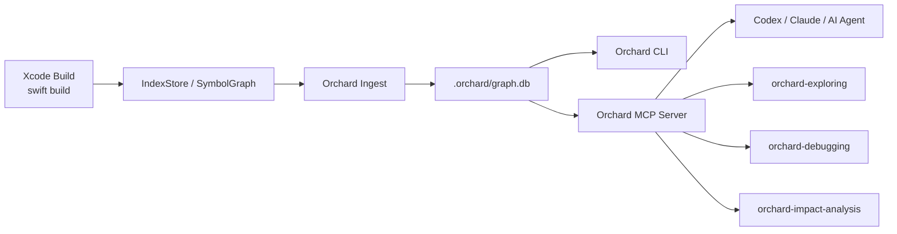

# Orchard 使用指南

> 面向 AI Agent / Codex / Claude 工程师的接入与工作流手册

## 1. 为什么是 Orchard

如果你已经在用 `grep`、LSP、IDE 跳转，或者像 GitNexus 这样的代码图工具，你可能会问：为什么还需要 Orchard？

答案很简单：`Orchard` 不是通用文本搜索，也不是 IDE 辅助跳转层。它的核心价值是把 Apple 平台真实编译过程中产出的语义工件变成一张可查询的语义图，再把这张图通过 CLI 和 MCP 暴露给 AI Agent 使用。

这里要先强调一个边界：

> Orchard 是 Apple 平台专用工具，面向 Swift、Objective-C、Objective-C++、C、C++ 工程，依赖 Xcode 构建产物和相关编译器语义工件。它不是 Android、Web、后端服务或通用多语言仓库的统一代码图方案。

它特别适合下面这类问题：

- “这个 Swift / ObjC 方法到底是谁在调？”
- “我改这个符号，会影响哪些调用链？”
- “这条 crash frame 能落到哪个 owner / method 上？”
- “这个通知是谁注册的，最后会回调到哪里？”
- “这个 iOS 工程里，登录 / 启动 / 恢复链路的入口在哪里？”

相较于常见手段，Orchard 的定位是：

- 比 `grep` 更强：它依赖编译器工件，不只是字符串匹配
- 比 LSP 更强：它不只回答单点跳转，还能做跨文件关系、impact、process、notification graph
- 和 GitNexus 互补：GitNexus 更偏通用代码图与执行流；Orchard 更强调 Apple 平台编译语义、IndexStore grounding、Swift / ObjC bridge

一句话记忆：

> 如果你想让 Agent 在 Apple 代码库里“基于编译器事实理解代码”，而不是“基于字符串猜代码”，那 Orchard 就是它该接的那层基础设施。

可以先用这张图快速建立整体印象：



从使用角度看，最关键的就是两件事：

- 先通过 `ingest` 把编译产物转换成 `.orchard/graph.db`
- 再让 CLI、MCP 和 skills 基于这份图谱为 Agent 提供理解、排障和 impact 能力

## 2. 5 分钟接入

### 2.1 安装 Orchard

你可以直接安装 CLI：

```bash
uv tool install git+ssh://git@git.zoom.us/ai-tools/orchard.git
```

或者本地开发方式安装：

```bash
git clone git@git.zoom.us:ai-tools/orchard.git
cd orchard
uv tool install -e .
```

前置条件：

- Python `>= 3.12`
- 本机能访问 Xcode toolchain
- 目标工程至少有一次较新的构建结果，这样才会产生 `IndexStore`
- 目标项目是 Apple 平台工程，而不是 Android / Web / 通用后端仓库

### 2.2 为目标工程建图

在你的 Apple 项目目录下执行：

```bash
orchard ingest
```

这一步会在项目目录下生成 `.orchard/graph.db`。

### 2.3 把 Orchard 接到 Agent 环境

如果你想给 Claude Code / Codex 一次性配好 MCP、skill 和文档注入，直接执行：

```bash
orchard setup
```

它会安装 Orchard 的 MCP 配置，以及以下 skills：

- `orchard`
- `orchard-cli`
- `orchard-debugging`
- `orchard-exploring`
- `orchard-impact-analysis`

同时，`orchard setup` 也会把 Orchard 的代码智能说明注入项目里的 `AGENTS.md` / `CLAUDE.md`。

### 2.4 做一次最小验证

建图完成后，先跑这几个命令确认链路通了：

```bash
orchard stats
orchard search --name "viewDidLoad"
orchard process
```

只要这些结果能返回符号、关系或 process，说明 Orchard 已经基本可用。

## 3. 面向 Agent 的核心工作流

对 AI Agent 来说，最重要的不是记住一组命令，而是形成一条稳定的理解路径。

推荐的总体思路是：

1. 先用 Orchard 找到正确的符号或入口
2. 再用图关系确认它的上下游依赖
3. 回到源码验证真实实现
4. 如果涉及修改，再评估 impact 和测试范围

这条路径的核心价值在于，它能让 Agent 先建立“关系正确性”，再做代码解释，而不是一开始就靠文本搜索和文件名猜测。

在日常使用里，你可以把 Orchard 理解成三种模式：

- 探索模式：当你想知道某个模块、方法或流程“是怎么工作的”
- 排障模式：当你已经有 bug、crash、callback 异常或 notification 异常，想知道“为什么没按预期工作”
- 风险评估模式：当你准备修改、重构、rename 或抽取逻辑，想知道“改了会影响谁”

如果你的 Agent 能稳定遵循这三步，Orchard 的价值就会非常明显：

- 更快找到真实入口
- 更少误判调用链
- 更早识别通知、回调、bridge 这类 Apple 特有边界
- 在修改前先看到 blast radius，而不是改完再补洞

## 4. 推荐 Skills

如果你主要是把 Orchard 接给 Agent 用，真正值得熟悉的不是 MCP 细节，而是这几个 skill 的分工。它们本质上是在告诉 Agent：面对不同任务，应该用 Orchard 走哪条路径。

### 4.1 `orchard-exploring`

`orchard-exploring` 适合“理解代码怎么工作”的场景。

典型问题：

- “这个模块是怎么运转的？”
- “谁在调用这个方法？”
- “登录流程从哪里进来？”
- “这个 notification 最后是谁处理？”

它的工作方式通常是：

1. 先用 `search` 找到最可能的符号
2. 用 `symbol` 确认 USR、文件、语言和模块
3. 用 `find_callers` / `find_callees` 建局部关系图
4. 必要时补 `find_references` 或 `hierarchy`
5. 再回到源码解释实现细节

你可以把它理解成：

> Orchard 版的“代码导览模式”。

它特别适合第一次进入陌生 Apple 工程时使用，因为它强调的是“先基于编译器图找对入口，再读代码”，而不是一上来就 grep。

### 4.2 `orchard-debugging`

`orchard-debugging` 适合“出了症状，要定位原因”的场景。

典型问题：

- “为什么这里会 crash？”
- “这条 frame 是从哪儿进来的？”
- “这个 callback 为什么没触发？”
- “这个 notification handler 为什么没跑到？”

它和 `orchard-exploring` 的区别在于：

- `exploring` 关注的是“这段代码怎么工作”
- `debugging` 关注的是“为什么它没按预期工作”

`orchard-debugging` 常见路径是：

1. 从 symptom、错误文本或 suspect symbol 开始
2. 如果只有一条 frame，就先走 `lookup_frame`
3. 再用 `symbol`、`find_callers`、`find_callees`、`find_references` 缩小范围
4. 特别关注 async boundary、notification wiring、delegate callback 和 `source_scope`
5. 最后回源码验证 root cause

这类 skill 很适合以下问题：

- 单条 crash frame 分析
- 回调链路不明
- 通知没触发
- 搜索命中异常、怀疑索引 stale

一句话说，`orchard-debugging` 是 Orchard 的“图辅助排障模式”。

### 4.3 `orchard-impact-analysis`

`orchard-impact-analysis` 适合“改之前先判断会不会炸”的场景。

典型问题：

- “改这个方法安全吗？”
- “有哪些地方依赖这个类？”
- “这次重构 blast radius 多大？”
- “我要 rename 这个符号，哪些调用点得一起改？”

它的核心动作很简单：

1. 对目标符号跑 `impact`
2. 先看 summary
3. 再重点看 d1
4. 必要时用 callers / references 补看敏感依赖
5. 最后把结果翻译成修改建议和测试建议

最重要的是理解它的输出：

- `d1`：最先会受影响的直接依赖者
- `d2`：下一层可能受波及的面
- `risk`：当前修改风险级别

如果你的 Agent 会帮你改代码，这个 skill 非常关键，因为它能把“先做 blast radius”变成默认动作。

建议把它当成团队规则：

> 非 trivial 修改前，先走 `orchard-impact-analysis`。

### 4.4 怎么选这三个 skill

可以用一个简单判断：

- 想理解代码结构和流程：用 `orchard-exploring`
- 已经出现 bug、crash、回调异常：用 `orchard-debugging`
- 准备修改、重构、rename、评估风险：用 `orchard-impact-analysis`

如果还是拿不准，一个很实用的顺序是：

```text
先 exploring 建立上下文
再 debugging 定位问题
最后 impact-analysis 评估修复风险
```

这也是 Orchard 在 Agent 场景下最自然的一条工作链。

## 5. 常见误区与排障

### 6.1 `search` 没结果，不一定是没这个符号

优先检查：

- 目标工程最近是否成功构建过
- `.orchard/graph.db` 是否来自当前项目
- 当前索引是否覆盖了你关心的 target
- 是否应该先刷新索引

建议直接重跑：

```bash
orchard ingest
```

### 6.2 索引 stale 了怎么办

只要项目发生了较大变更，或者你切换了分支、改了 target、更新了构建输出，都应该考虑重新 ingest。

经验法则：

- 看结果像旧的：refresh
- 新文件 / 新方法搜不到：refresh
- Agent 明显在旧关系上推理：refresh

### 6.3 不要把完整 crashlog 直接塞给 `lookup_frame`

这是最常见误区之一。

`orchard_lookup_frame` 适合的是：

- 一条具体 frame
- 一个明确 symbol 文本
- 一个较清晰的 owner / method 线索

如果你手里是完整 crashlog，先抽出最关键的单条 frame，再继续。

### 6.4 Orchard 不是所有问题都比 grep 快

如果你只是：

- 找一个配置名
- 搜一个常量
- 看一段注释文本

那 `rg` 往往更直接。

Orchard 的价值在“关系正确性”和“语义路径”，不是取代所有文本搜索。

### 6.5 notification / bridge 场景不要硬套普通 caller 链

有些关系不是普通同步调用，而是：

- 通知回调
- delegate 回调
- framework callback
- Swift / ObjC bridge

这时如果只看普通 caller / callee，结论可能不完整。要主动切到更合适的 Orchard 能力。

### 6.6 先确认环境，再怀疑工具

排障顺序建议是：

1. 工程是否成功构建
2. IndexStore 是否存在
3. `.orchard/graph.db` 是否在当前工程树里
4. 是否需要重新 ingest
5. 是否用了不合适的查询入口

很多“Orchard 不准”的问题，最后其实是环境或输入路径不对。

## 结语

把 Orchard 接进 Agent 工作流之后，最大的变化不是“多了几个命令”，而是 Agent 对 Apple 代码库的理解方式变了。

它不再主要依赖：

- 文件名猜测
- 文本搜索命中
- 人工拼接调用链

而是先建立“编译器事实 -> 语义关系 -> 代码解释”的路径。

如果你只记住一条实践建议，那就是这句：

> 在 Apple 代码库里，让 Agent 先用 Orchard 找关系，再去读源码做解释。

这通常会比“先 grep、再猜、再补洞”稳得多。

## 参考命令速查

```bash
orchard ingest
orchard setup
orchard stats
orchard search --name "viewDidLoad"
orchard search --class "MeetingViewController"
orchard find_callers --usr "<USR>"
orchard find_callees --usr "<USR>"
orchard impact --usr "<USR>"
orchard process
orchard process show <process_id>
orchard notification-graph --notification-name "Logout"
```
