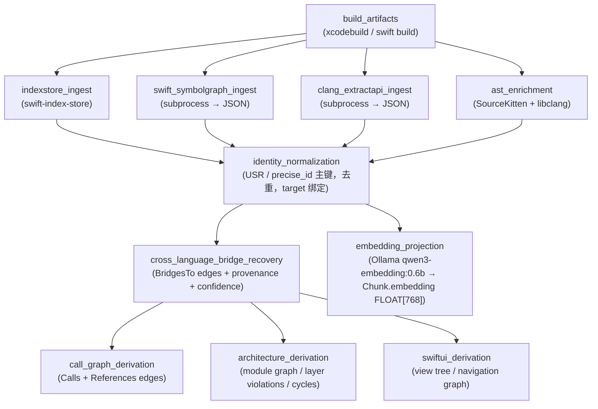

# Orchard Python Implementation — Apple Semantic Graph System

**Date**: 2026-06-24  
**Status**: Approved  
**Milestone**: 0–5 (Complete)

---

## 1. 项目定位

**Orchard** 是一个用 Python 实现的 Compiler-Grade Apple Semantic Graph 系统。

以编译器工件（IndexStore / Symbol Graph / AST）为事实真源，构建跨语言（Swift / Objective-C / C / C++）统一语义图谱，通过 MCP 工具接口提供给 AI Agent 使用。

核心价值主张：
- **不是** LSP wrapper、不是 grep、不是 tree-sitter
- **是** compiler artifacts → unified graph → MCP query interface 的完整管道
- **非 UI 系统**，纯后端 Python 库 + MCP Server

---

## 2. 技术栈

| 层 | 选型 | 说明 |
|---|---|---|
| **图数据库** | [Ladybug](https://github.com/LadybugDB/ladybug) | `pip install ladybug`，KuzuDB 演进版。Cypher + FTS + vector index + ACID + 单文件持久化 |
| **IndexStore 摄取** | `orchard-indexstore-reader`（随包发布的薄 Swift CLI） | 无现成 Python bindings for IndexStoreDB。策略：提供一个用 Swift 编写的轻量 CLI tool，通过 subprocess 调用，输出 occurrences/relations 的 newline-delimited JSON。Binary 预构建后随 Python 包发布（macOS arm64/x86_64）。 |
| **Symbol Graph 解析** | subprocess → JSON | `swift-symbolgraph-extract` / `clang -extract-api` 产出 JSON，Python 直接解析 |
| **AST 层** | subprocess + `clang.cindex` | SourceKitten（Swift struct/docs）via subprocess；libclang via `libclang` Python 绑定 |
| **MCP 框架** | `mcp` Python SDK | `pip install mcp`，官方 Python MCP Server 框架 |
| **Embedding** | `qwen3-embedding:0.6b` via Ollama | 本地运行，无 API Key，768 维，代码数据不出境，Apple Silicon 友好 |
| **构建触发** | subprocess | `xcodebuild build` / `swift build` |
| **包管理** | `uv` + `pyproject.toml` | 现代 Python 项目管理 |

---

## 3. 仓库结构

```
orchard/
├── src/
│   └── orchard/
│       ├── __init__.py
│       ├── build/              # BuildContext 采集、artifact 路径发现
│       │   ├── context.py      # BuildContext dataclass
│       │   ├── collector.py    # xcodebuild / swift build 调用与日志解析
│       │   └── discovery.py    # IndexStore / Symbol Graph 路径探测
│       ├── ingest/             # 原始工件摄取
│       │   ├── indexstore.py   # swift-index-store 封装
│       │   ├── symbolgraph.py  # Swift symbol graph JSON 解析
│       │   ├── extractapi.py   # Clang ExtractAPI JSON 解析
│       │   └── ast.py          # SourceKitten / libclang on-demand AST
│       ├── normalize/          # identity normalization
│       │   ├── identity.py     # USR / precise_id 主键策略、去重、归属绑定
│       │   └── bridge.py       # cross-language bridge normalization
│       ├── derive/             # 派生层（建立在归一化图之上）
│       │   ├── callgraph.py    # Calls / References 边派生
│       │   ├── bridge.py       # cross_language_bridge_recovery phase
│       │   ├── architecture.py # module graph / layer violation / cycles
│       │   ├── swiftui.py      # SwiftUI view tree / navigation flow
│       │   └── impact.py       # impact_analysis traversal policy
│       ├── graph/              # Ladybug schema、queries、adapters
│       │   ├── schema.py       # CREATE NODE / REL TABLE 定义
│       │   ├── db.py           # Ladybug 连接管理、事务封装
│       │   └── queries.py      # Cypher 查询模板
│       ├── search/             # 语义检索
│       │   ├── chunker.py      # symbol → chunk 切块策略
│       │   ├── embedder.py     # Ollama qwen3-embedding:0.6b 接入
│       │   └── retriever.py    # vector + FTS 混合检索
│       ├── mcp/                # MCP Server 层
│       │   ├── server.py       # MCP Server 入口
│       │   ├── tools.py        # 工具注册
│       │   └── handlers/       # 每个工具的 handler
│       │       ├── symbol_context.py
│       │       ├── callers.py
│       │       ├── callees.py
│       │       ├── impact.py
│       │       ├── bridges.py
│       │       ├── semantic_search.py
│       │       ├── type_hierarchy.py
│       │       ├── view_tree.py
│       │       ├── navigation_flow.py
│       │       ├── module_graph.py
│       │       └── layer_violations.py
│       └── validation/         # phase audit、freshness 检查
│           ├── audit.py        # phase DAG 状态追踪
│           └── freshness.py    # build config hash 对比、staleness 判定
├── tests/
│   ├── fixtures/               # sample projects for acceptance tests
│   ├── test_ingest/
│   ├── test_normalize/
│   ├── test_derive/
│   ├── test_graph/
│   ├── test_search/
│   └── test_mcp/
├── pyproject.toml
└── docs/
```

---

## 4. Phase DAG（索引流程）



每个 Phase 输出 `PhaseResult[T]`：
```python
@dataclass
class PhaseResult(Generic[T]):
    phase: str
    build_id: str
    data: T
    stats: dict[str, int] = field(default_factory=dict)
    warnings: list[str] = field(default_factory=list)
```

---

## 5. Ladybug 图 Schema

### 5.1 BuildContext（摄取时输入）

```python
@dataclass
class BuildContext:
    build_id: str
    build_system: Literal["xcodebuild", "swift_build", "other"]
    workspace_root: str
    scheme: str | None
    target: str
    configuration: str
    sdk: str
    triple: str
    toolchain_id: str
    derived_data_path: str | None
    index_store_path: str | None
    symbolgraph_output_path: str | None
    commit_sha: str | None
    build_config_hash: str
```

### 5.2 Node Tables（Cypher）

```cypher
CREATE NODE TABLE BuildSnapshot(
  id STRING PRIMARY KEY,
  build_system STRING,
  workspace_root STRING,
  derived_data_path STRING,
  index_store_path STRING,
  toolchain_id STRING,
  commit_sha STRING,
  created_at STRING,
  build_config_hash STRING
);

CREATE NODE TABLE Module(
  name STRING PRIMARY KEY,
  language STRING
);

CREATE NODE TABLE Target(
  id STRING PRIMARY KEY,
  name STRING,
  platform STRING,
  sdk STRING,
  triple STRING,
  configuration STRING
);

CREATE NODE TABLE File(
  path STRING PRIMARY KEY,
  module STRING,
  language STRING,
  target_id STRING,
  is_generated BOOLEAN
);

CREATE NODE TABLE Symbol(
  -- 主键策略：usr 在同一 target 内唯一，但多 target 场景（Debug/Release、fat binary、
  -- 条件编译）同一符号 USR 可能相同语义不同。采用 target-scoped composite key：
  -- 以 "{target_id}:{usr}" 为实际主键字符串，保留 usr 和 target_id 作为查询字段。
  id STRING PRIMARY KEY,         -- "{target_id}:{usr}"
  usr STRING,                    -- 原始 USR（用于跨 target 查找同名符号）
  precise_id STRING,
  name STRING,
  language STRING,
  kind STRING,
  module STRING,
  target_id STRING,
  file_path STRING,
  signature STRING,
  container_usr STRING,
  access_level STRING,
  origin STRING,
  is_generated BOOLEAN
);

CREATE NODE TABLE Occurrence(
  id STRING PRIMARY KEY,
  usr STRING,
  file_path STRING,
  line INT64,
  column INT64,
  role STRING
);

CREATE NODE TABLE Chunk(
  id STRING PRIMARY KEY,
  owner_usr STRING,
  chunk_kind STRING,
  content STRING,
  embedding FLOAT[768]
);

CREATE NODE TABLE Diagnostic(
  id STRING PRIMARY KEY,
  phase STRING,
  severity STRING,
  code STRING,
  message STRING
);
```

### 5.3 Relation Tables（Cypher）

```cypher
CREATE REL TABLE ContainsFile(FROM Module TO File);
CREATE REL TABLE ContainsTarget(FROM Module TO Target);
CREATE REL TABLE BuiltTarget(FROM BuildSnapshot TO Target);
CREATE REL TABLE ObservedFile(FROM BuildSnapshot TO File);
CREATE REL TABLE Declares(FROM File TO Symbol);
CREATE REL TABLE ContainsChunk(FROM Symbol TO Chunk);
CREATE REL TABLE ContainsOccurrence(FROM File TO Occurrence);
CREATE REL TABLE RefersTo(FROM Occurrence TO Symbol, role STRING);

CREATE REL TABLE Calls(
  FROM Symbol TO Symbol,
  source STRING,
  confidence DOUBLE,
  provenance STRING,
  build_id STRING
);

CREATE REL TABLE References(
  FROM Symbol TO Symbol,
  source STRING,
  confidence DOUBLE
);

CREATE REL TABLE Inherits(FROM Symbol TO Symbol, source STRING);
CREATE REL TABLE Implements(FROM Symbol TO Symbol, source STRING);
CREATE REL TABLE Imports(FROM File TO File, kind STRING);
CREATE REL TABLE ConformsTo(FROM Symbol TO Symbol, source STRING);

CREATE REL TABLE BridgesTo(
  FROM Symbol TO Symbol,
  bridge_kind STRING,
  provenance STRING,
  confidence DOUBLE,
  build_id STRING
);

CREATE REL TABLE ProducedDiagnostic(FROM BuildSnapshot TO Diagnostic);
```

---

## 6. SymbolNode / Edge 统一模型（Python）

```python
from typing import Literal

Language = Literal["swift", "objc", "cpp", "c"]
SymbolKind = Literal["class", "protocol", "function", "method", "struct",
                     "enum", "extension", "property", "typealias"]
Origin = Literal["indexstore", "swift_symbolgraph", "clang_extractapi",
                 "sourcekitten", "libclang", "derived"]

@dataclass
class SymbolNode:
    usr: str
    precise_id: str | None
    language: Language
    kind: SymbolKind
    name: str
    module: str
    file_path: str
    target: str | None = None
    container_usr: str | None = None
    signature: str | None = None
    access_level: str | None = None
    origin: Origin | None = None
    is_generated: bool = False
    availability: list[str] = field(default_factory=list)

@dataclass
class Edge:
    type: Literal["calls", "references", "inherits", "implements",
                  "imports", "contains", "bridges_to"]
    from_usr: str
    to_usr: str
    source: Origin | None = None
    confidence: float | None = None
    provenance: str | None = None
    build_id: str | None = None
```

---

## 7. MCP 工具接口

### 7.1 统一基类

```python
@dataclass
class BaseToolRequest:
    repo_root: str | None = None
    build_id: str | None = None
    target: str | None = None
    module: str | None = None
    include_derived: bool = True
    max_depth: int = 5

@dataclass
class BaseToolResponse(Generic[T]):
    data: T
    freshness: Literal["fresh", "stale", "partially_stale",
                       "build_mismatch", "toolchain_mismatch"]
    build_id: str | None = None
    target: str | None = None
    module: str | None = None
    evidence_sources: list[str] = field(default_factory=list)
    confidence: float | None = None
    open_gaps: list[str] = field(default_factory=list)
```

### 7.2 工具列表与实现优先级

| 优先级 | 工具 | 依赖 Phase | Milestone |
|---|---|---|---|
| **P1** | `get_symbol_context` | indexstore_ingest + identity_normalization | M2 |
| **P1** | `find_callers` | call_graph_derivation | M2 |
| **P1** | `find_callees` | call_graph_derivation | M2 |
| **P1** | `impact_analysis` | call_graph_derivation + bridge_recovery | M3 |
| **P1** | `get_cross_language_bridges` | bridge_recovery | M3 |
| **P2** | `semantic_search` | embedding_projection | M4 |
| **P2** | `get_type_hierarchy` | swift_symbolgraph_ingest + normalization | M2 |
| **P2** | `get_module_graph` | architecture_derivation | M4 |
| **P2** | `find_layer_violations` | architecture_derivation | M4 |
| **P3** | `get_view_tree` | swiftui_derivation | M5 |
| **P3** | `find_navigation_flow` | swiftui_derivation | M5 |
| **P3** | `find_cycles` | architecture_derivation | M5 |

### 7.3 impact_analysis 遍历策略

```python
@dataclass
class ImpactTraversalPolicy:
    relation_types: list[str] = field(default_factory=lambda: [
        "calls", "references", "implements"
    ])
    include_low_confidence: bool = False
    include_bridge_edges: bool = True
    stop_at_target_boundary: bool = False
    stop_at_module_boundary: bool = False
    max_depth: int = 5
```

风险分级：

| Risk | 条件 |
|---|---|
| `low` | 仅少量 d=1 调用方，无跨 target / bridge 依赖 |
| `medium` | 多个 d=1 调用方，或 module 内广泛引用 |
| `high` | 跨 module / target 扩散，或存在 bridge dependents |
| `critical` | 跨 target + 跨 bridge + 高扇出同时出现，或 `freshness != fresh` |

### 7.4 bridge confidence 策略

| Confidence | 条件 |
|---|---|
| `1.0` | 直接 USR / precise_id 对齐 |
| `0.95` | generated interface / explicit mapping |
| `0.85` | selector + module + signature 组合命中 |
| `0.70` | import visibility + local AST heuristic |
| `< 0.70` | 仅名称近似，不进入默认 impact 主路径 |

---

## 8. Embedding 层

- **模型**：`qwen3-embedding:0.6b`
- **运行方式**：Ollama 本地服务（`ollama run qwen3-embedding:0.6b`）
- **接入**：HTTP `POST http://localhost:11434/api/embeddings`
- **向量维度**：768（Ladybug schema `FLOAT[768]`）
- **切块粒度**：type / method / extension / SwiftUI View
- **检索**：vector similarity + FTS 混合，结果通过 `owner_usr` 回跳到 Symbol / File / Module

```python
# src/orchard/search/embedder.py
import httpx

OLLAMA_MODEL = "qwen3-embedding:0.6b"
EMBEDDING_DIM = 768

async def embed(text: str) -> list[float]:
    resp = await httpx.AsyncClient().post(
        "http://localhost:11434/api/embeddings",
        json={"model": OLLAMA_MODEL, "prompt": text},
    )
    return resp.json()["embedding"]
```

---

## 9. Freshness / Staleness 元数据

```python
@dataclass
class GraphFreshness:
    build_id: str
    created_at: str
    commit_sha: str | None
    toolchain_id: str
    sdk: str
    configuration: str
    build_config_hash: str
    index_store_path: str
```

Freshness 状态：
- `fresh`：源码与构建快照一致
- `stale`：源码或 commit 已变，图未重建
- `partially_stale`：部分 target 重建，部分未重建
- `build_mismatch`：查询上下文与图的 build config 不一致
- `toolchain_mismatch`：Xcode / Swift / SDK 版本不一致

规则：`freshness != fresh` 时，`impact_analysis` 风险至少上调一档。

---

## 10. Phase Audit 输出格式

```json
{
  "build_id": "build-20260624-001",
  "phases": [
    {
      "name": "indexstore_ingest",
      "status": "ok",
      "stats": {
        "occurrences": 182340,
        "relations": 29411
      },
      "warnings": []
    },
    {
      "name": "cross_language_bridge_recovery",
      "status": "ok",
      "stats": {
        "bridging_header": 42,
        "generated_swift_interface": 81,
        "objc_selector": 17,
        "low_confidence_bridges": 9,
        "unresolved_candidates": 13
      },
      "warnings": []
    }
  ]
}
```

---

## 11. Milestone 实现路线

### Milestone 0：Build Ground Truth
**目标**：稳定获取 build context 和 compiler artifacts

交付：
- `BuildContext` dataclass + 采集器
- `BuildSnapshot` 落库逻辑（Ladybug）
- IndexStore 路径探测（DerivedData 目录扫描）
- Swift / Clang symbol graph 文件发现
- SourceKitten / libclang 调用适配层

验收：
- 对 sample 工程可稳定生成 `build_id`
- 能记录 target / sdk / toolchain_id
- 能定位 index store 和 symbol graph 输出路径

### Milestone 1：Canonical Identity Graph
**目标**：把原始工件统一成稳定 symbol identity

交付：
- Module / Target / File / Symbol / Occurrence 节点导入
- `identity_normalization` phase（USR 主键策略）
- origin / provenance 基础字段
- 同名不同 target symbol 去歧义

验收：
- 无非法主键冲突
- 同名不同 target 的 symbol 不串
- Ladybug 中节点计数与 artifact 原始数量对齐

### Milestone 2：Core Query Surface
**目标**：跑通最有价值的只读查询

交付：
- `get_symbol_context` MCP tool
- `find_callers` MCP tool
- `find_callees` MCP tool
- `get_type_hierarchy` MCP tool

验收：
- 对样例工程返回结构稳定
- 所有查询带 `freshness`
- 返回中有 `evidence_sources`

### Milestone 3：Bridge & Impact
**目标**：跨语言 bridge + blast radius 分析

交付：
- `cross_language_bridge_recovery` phase
- `get_cross_language_bridges` MCP tool
- `impact_analysis` MCP tool（含 risk scoring + traversal policy）

验收：
- Swift + ObjC 混编工程能恢复高置信 bridge
- `impact_analysis` 能区分 direct callers 与 bridge dependents
- stale graph 会上调风险

### Milestone 4：Retrieval & Architecture
**目标**：语义检索 + 架构分析

交付：
- chunking + `embedding_projection`（qwen3-embedding:0.6b）
- `semantic_search` MCP tool
- `architecture_derivation` phase
- `get_module_graph` MCP tool
- `find_layer_violations` MCP tool

验收：
- `semantic_search` 能回跳到 symbol / file / module
- architecture tools 能输出 module edge 与 violation 统计

### Milestone 5：SwiftUI & Advanced Analysis
**目标**：高派生性能力

交付：
- `swiftui_derivation` phase
- `get_view_tree` MCP tool（含 derived_from + confidence < 1.0）
- `find_navigation_flow` MCP tool
- `find_cycles` MCP tool

验收：
- 所有 SwiftUI 结果标记 `derived_from`
- 动态组合进入 `open_gaps`，不伪装成高置信 truth

---

## 12. 最小验收用例

### A. 单 target Swift-only 工程
- `semantic_search` 能命中 method / type / extension chunk
- `get_symbol_context` 能返回 callers / callees
- `impact_analysis` 不跨不存在的 bridge 扩散

### B. Swift + Objective-C 混编工程
- `get_cross_language_bridges` 能恢复至少一条 Swift ↔ ObjC bridge
- `impact_analysis` 能把 bridge dependents 单独统计
- unresolved bridge 进入 register，不 silently drop

### C. 多 target / framework 工程
- `BuildSnapshot` 正确区分 target
- `get_symbol_context` 不把不同 target 同名 symbol 混淆
- `impact_analysis` 能汇总 affected targets

### D. Stale graph 场景
- 返回 `freshness = stale` 或 `build_mismatch`
- 风险分级至少上调一档
- `open_gaps` 解释为什么结果不应被视为高置信

### E. SwiftUI 派生场景
- `get_view_tree` 返回 `derived_from`
- `confidence < 1.0`
- 遇到动态组合时进入 `open_gaps`

### F. partially_stale 场景（review 补充）
- 多 target 工程仅部分 target 重建
- 返回 `freshness = partially_stale`
- `open_gaps` 说明哪些 target 数据陈旧

### G. toolchain_mismatch 场景（review 补充）
- Xcode 版本变更后查询
- 返回 `freshness = toolchain_mismatch`
- `impact_analysis` 风险至少上调一档

### H. confidence < 0.70 bridge gate（review 补充）
- 低置信 bridge 不出现在 `impact_analysis` 默认结果中
- 仅出现在 `get_cross_language_bridges` 的完整返回中
- `open_gaps` 记录低置信 bridge 数量

---

## 13. 设计原则总结

- **Compiler artifacts first**：IndexStore / Symbol Graph / AST 是事实真源，不是 LSP 或 grep
- **Build-aware**：所有查询结果绑定 `build_id` + `freshness`
- **Provenance everywhere**：每条派生边保留来源和置信度
- **Derived is derived**：call graph / impact / SwiftUI / architecture 都是派生层，不混写成底层直接输出
- **Local-first**：Ladybug 嵌入式 + Ollama 本地 embedding，代码数据不出境

---

---

## 14. Spec Review 变更记录

**Review 日期**：2026-06-24  
**Review 视角**：开发（development）、架构设计（design）、测试（testing）  
**Review 产物**：`docs/superpowers/specs/reviews/review-{development,design,testing}.md`

### 根据 review 更新的内容

| 变更 | 来源 | 变更内容 |
|---|---|---|
| IndexStore 摄取策略 | 开发 review | 改为薄 Swift CLI wrapper（`orchard-indexstore-reader`），无 PyPI Python bindings |
| Symbol 主键策略 | 设计 review | 改为 `id = "{target_id}:{usr}"` 复合主键字符串，避免多 target 冲突 |
| 新增 ConformsTo 关系 | 设计 review | 增加 `ConformsTo(FROM Symbol TO Symbol)` Relation Table |
| 新增验收场景 F/G/H | 测试 review | partially_stale、toolchain_mismatch、confidence < 0.70 gate |

### Review 结论

- **开发就绪度**：3/5 — Ladybug 包名已确认无冲突；IndexStore 摄取方案已明确（Swift CLI wrapper）；Phase DAG 调度器选定 asyncio + 手写 DAG
- **设计质量**：4/5 — 主键问题已修复；派生层分离和 freshness 设计扎实
- **可测性**：3/5 — 基础框架合理；fixture 策略和 subprocess mock 策略待 Milestone 0 时确定

**总体结论**：规格文档已更新并准备好进入实现规划阶段。

---

*此文档由 Orchard brainstorming 阶段生成，已获用户批准，经三视角 review 后更新，作为后续规划和实现阶段的输入。*
